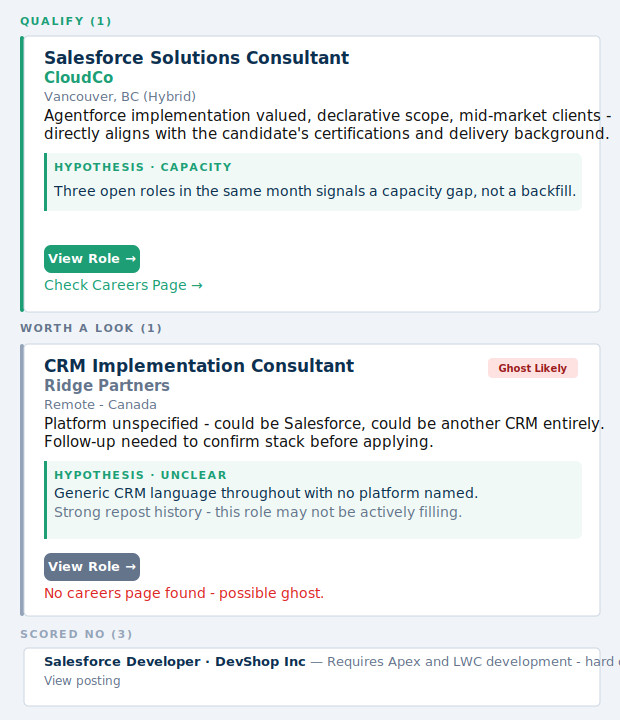

# Pathfinder: Cut the Job Search BS

Job searching produces too many listings and no good way to evaluate them. Reading through dozens of postings a day to figure out which ones actually fit your background takes real time, and most of them don't fit. The ones that do are buried.

Pathfinder searches LinkedIn every morning, scores every posting against your specific background using AI, and emails you only the roles worth pursuing. Typically 2–5 results out of 300+ raw listings. It runs automatically on GitHub and costs nothing to operate.

**What's in each digest:**
- **AI scoring:** YES, MAYBE, or NO with a plain-language reason for every posting
- **Hiring hypothesis:** two signals per relevant posting - why the company is hiring (backfill, new capability, capacity, recovery, or strategic bet) and what specific value the candidate brings to address the challenge that hire exists to solve. The hypothesis category is informed by both posting language and historical tracking data: repeated postings of a similar role suggest Backfill or Recovery; multiple open headcount from the same company suggests Capacity. Signal improves as the tracker accumulates history.
- **Ghost detection:** a badge on any posting showing signs of not being actively filled, based on age and repost history
- **Careers page link:** a direct link to the company's jobs page when one can be found, or a flagged warning when it can't
- **Reply-to-correct:** reply to any digest email to correct a wrong ghost result; the override applies to future runs automatically
- **Salesforce push:** YES and MAYBE results can be pushed directly into a Salesforce Career Pipeline object (optional)

**Ghost detection gets better the longer Pathfinder runs.** Each daily run stores every scraped job, company, title, and posting date, in a local database. When the same company re-posts a similar role with a newer date, that's the repost signal. After a few weeks of history, Pathfinder recognizes recurring phantom listings that haven't been filled. A fresh install has no history to draw on. Expect meaningful ghost signal after 3–4 weeks of daily runs.



---

## How long does setup take?

Depends on where you're starting from.

**If you've never heard of VS Code or a terminal: 2 to 3 hours.**

Most of that time is not the installs -- it's Episode 4. Writing your `highlights` and scoring criteria is the hardest part for everyone. The AI prompts in Episode 3.5 help, but plan for 45 minutes just on the config. Add another 30-45 minutes for installing VS Code, Python, and Git if you're starting from zero, plus 20-30 minutes to create accounts and get your API keys. Local test and going live add another 30 minutes once everything is in place.

**If you're comfortable with a terminal and have used Python or Git before: 1 to 1.5 hours.**

Accounts and API keys take 10-15 minutes. Fork, clone, and setup take another 10. The config -- especially writing good highlights -- still takes 20-30 minutes even if you know what you're doing. Local test and going live add 20-30 minutes.

**The config is the bottleneck for everyone.** The installs are mechanical. Getting your highlights specific and outcome-focused enough to produce accurate scores is where the real time goes. Use the AI prompts in the "Before Episode 4" section. They cut the time in half.

---

## Quick reference

All commands you'll use. Details are in the episodes below.

### Python / Shell

| Command | What it does |
|---|---|
| See Episode 3 | First-time setup: creates `.venv`, installs deps, copies `.env` |
| `.\.venv\Scripts\Activate.ps1` | Activate virtual environment (Windows - PowerShell) |
| `source .venv/bin/activate` | Activate virtual environment (Mac) |
| `python pathfinder.py --preview` | Send a sample digest email (no API calls, no job queries) |
| `python pathfinder.py --test` | Run pipeline in test mode (2 queries, capped results) |
| `bash pathfinder/clean_db.sh` | Reset seen-jobs database (Mac/Git Bash) |

### Git

Every time you change a file and want GitHub Actions to use it, you run three commands in order:

1. `git add .` - packs up everything you changed
2. `git commit -m "..."` - saves that package locally with a label describing what you changed
3. `git push` - uploads it to GitHub so the next automated run picks it up

**Commit** saves a snapshot on your machine. **Push** sends it to GitHub. You need both.

| Command | What it does |
|---|---|
| `git clone https://github.com/YOUR_USERNAME/Pathfinder.git` | Download your fork to your computer |
| `git add .` | Pack up all changed files ready to save |
| `git commit -m "describe what you changed"` | Save a snapshot locally (e.g. `"update scoring criteria"`) |
| `git push` | Upload your saved snapshots to GitHub |

### VS Code

| Action | How |
|---|---|
| Open terminal | Ctrl+` (Windows) / Cmd+` (Mac) |
| Open project folder | File > Open Folder → select the `Pathfinder` folder |

---

## What this is

**Self-hosted.** Pathfinder runs entirely on your own GitHub account using free GitHub Actions. Nothing runs on any third-party server. No account to create, no subscription, no tracking.

**Non-monetized.** This is an open source tool. Free to use, free to modify, free to share.

**Low cost.** The AI scoring uses Groq's free tier. No credit card required. Gmail and GitHub are both free. Total ongoing cost: $0.

---

## Episode 1: What you need before you start

Watch this episode before installing anything. You'll create the accounts you need and gather your API keys so they're ready when you need them.

**Accounts to create:**

| Account | Where | Cost |
|---|---|---|
| GitHub | github.com | Free |
| Groq (AI scoring) | console.groq.com | Free |
| Gmail (to send digest) | gmail.com | Free |

See **How long does setup take?** above the Quick Reference for realistic time estimates by experience level. Optional Salesforce integration adds roughly 30 minutes on top.

### Get your Groq API key

Groq runs the AI that scores job listings. Free, no credit card.

1. Go to [console.groq.com](https://console.groq.com)
2. Sign up with Google or email
3. Click **API Keys** in the left sidebar
4. Click **Create API Key**, name it "pathfinder"
5. Copy the key. It starts with `gsk_`.
6. Save it somewhere. You only see it once.

### Get your Gmail App Password

This lets Pathfinder send your digest without using your real Gmail password. Gmail requires 2-Step Verification to be on before this works.

1. Go to [myaccount.google.com](https://myaccount.google.com)
2. Click **Security** in the left sidebar
3. Confirm **2-Step Verification** is turned on. If it's off, turn it on first.
4. Go to [myaccount.google.com/apppasswords](https://myaccount.google.com/apppasswords)
5. Type "pathfinder" in the app name field, click **Create**
6. Copy the 16-character password (looks like: `abcd efgh ijkl mnop`)
7. Save it. Remove the spaces when you use it. It's one 16-character string.

---

## Episode 2: Install the tools

You need three things installed: VS Code (code editor), Python (runs Pathfinder), and Git (downloads the files). Install them in any order.

### VS Code

VS Code is the editor you'll use to view and edit your config files.

1. Go to [code.visualstudio.com](https://code.visualstudio.com)
2. Click **Download**. It detects your OS automatically.
3. Run the installer and accept all defaults.

### Python

Check if you already have it:
```
python --version
```

If you see `Python 3.10.x` or higher, skip this section.

**Windows:**
1. Go to [python.org/downloads](https://www.python.org/downloads/)
2. Click **Download Python 3.x.x**
3. Run the installer
4. **Check "Add Python to PATH"** on the first screen. This is easy to miss and required.
5. Click **Install Now**
6. Close and reopen your terminal, then run `python --version` to confirm

**Mac:**
```
brew install python3
```

If you don't have Homebrew:
```
/bin/bash -c "$(curl -fsSL https://raw.githubusercontent.com/Homebrew/install/HEAD/install.sh)"
```

Then run `brew install python3`. Confirm with `python3 --version`.

### Git

Check if you already have it:
```
git --version
```

If not:
- **Windows:** Download from [git-scm.com](https://git-scm.com/download/win), run the installer, accept all defaults
- **Mac:** Run `brew install git`

**How to open a terminal:**
- **Windows:** Press `Win + R`, type `cmd`, press Enter. Or open VS Code and press `` Ctrl+` ``.
- **Mac:** Press `Cmd + Space`, type "Terminal", press Enter. Or open VS Code and press `` Cmd+` ``.

---

## Episode 3: Fork the repo and run setup

### Fork and clone

Fork first. This creates your own copy of Pathfinder on GitHub that you control.

1. Go to [github.com/wadecurtis/Pathfinder](https://github.com/wadecurtis/Pathfinder)
2. Click **Fork** (top right) then **Create fork**
3. Open VS Code, then open a terminal (`` Ctrl+` `` on Windows, `` Cmd+` `` on Mac)
4. Clone your fork:

```
git clone https://github.com/YOUR_USERNAME/Pathfinder.git
cd Pathfinder
```

Replace `YOUR_USERNAME` with your GitHub username.

5. Open the folder: **File > Open Folder** and select the `Pathfinder` folder.

### Run setup

**Windows (PowerShell - VS Code terminal):**

Run these four commands in order from the Pathfinder folder:

```powershell
python -m venv .venv
.\.venv\Scripts\Activate.ps1
pip install --upgrade pip
pip install -r pathfinder/requirements.txt
```

> If PowerShell says "running scripts is disabled" on the second line: run `Set-ExecutionPolicy -ExecutionPolicy RemoteSigned -Scope CurrentUser` then try again.

**Mac:**
```
bash pathfinder/setup.sh
```

This will:
- Create a `.venv` virtual environment
- Install all Python dependencies
- Copy `pathfinder/.env.example` to `pathfinder/.env` (Mac only - Windows: copy it manually or see Episode 4)

### Activate the virtual environment

Every time you open a new terminal, activate `.venv` before running any Python commands:

**Windows (PowerShell):**
```powershell
.\.venv\Scripts\Activate.ps1
```

**Mac:**
```
source .venv/bin/activate
```

You'll see `(.venv)` at the start of your terminal line when it's active. You need this active every time you run Pathfinder locally.

---

## Before Episode 4: Build your profile with AI

The two hardest parts of config.yaml to write are your `highlights` and your `scoring` criteria. These prompts help you get them right before you fill in the file.

### Prompt 1 - Build your highlights

Paste this into [Claude](https://claude.ai) or ChatGPT and answer the questions it asks. Then paste the result into the `highlights:` section of `config.yaml`.

```
I'm setting up an automated job scoring tool that evaluates postings against my background.
The tool reads a list of "highlights" - specific, evidence-based facts about my experience -
and uses them to decide whether a job is a YES, MAYBE, or NO for me.

I need you to interview me to build this list. Ask me 6-8 questions, one at a time, that will
surface the most specific and outcome-focused facts about my background. Focus on:
- What I've delivered end-to-end, not just what tools I've used
- Quantified outcomes where possible (revenue, team size, deal count, system scope)
- Certifications, with dates if recent
- Where I'm strong versus where I'm still building

After I answer all your questions, write the highlights list in this format:
- "Fact one in plain language"
- "Fact two in plain language"
...

Keep each bullet to one sentence. Be specific and concrete. No vague claims like "strong communicator"
or "fast learner." If I give you vague answers, push back and ask for specifics.
```

### Prompt 2 - Validate your scoring criteria

Once you have a draft `qualify`, `neutral`, and `disqualify` list, paste this into Claude or ChatGPT along with a few real job descriptions you've seen recently. It will tell you how each would score and whether your criteria are calibrated correctly.

```
I'm configuring a job scoring tool. It evaluates postings as YES, MAYBE, or NO using these rules:

QUALIFY (push toward YES):
[paste your qualify list]

NEUTRAL (present but not disqualifying):
[paste your neutral list]

DISQUALIFY (any one = automatic NO):
[paste your disqualify list]

I'm going to paste 3 job descriptions below. For each one:
1. Score it YES, MAYBE, or NO based on my criteria
2. Name the single most important qualify or disqualify signal that decided the score
3. Flag anything where my criteria are ambiguous, too broad, or likely to produce false positives/negatives

After all three, give me a one-paragraph assessment of whether my criteria are well-calibrated
or need adjustment, and suggest any specific changes.

Job 1:
[paste a job description]

Job 2:
[paste a job description]

Job 3:
[paste a job description]
```

Use the feedback to tighten your criteria before running Pathfinder live.

---

## Episode 4: Fill in your config

Two files to fill in. Open them side by side in VS Code.

### config.yaml

First, copy the example config to create your own:

```
cp config.example.yaml config.yaml
```

`config.yaml` will be committed to your private fork - that's how GitHub Actions reads it. Your fork is private, so this is safe.

### pathfinder/.env

Open `pathfinder/.env`. Replace the placeholder values with the keys you got in Episode 1:

```
GROQ_API_KEY=gsk_your_key_here
GMAIL_SENDER=you@gmail.com
GMAIL_APP_PASSWORD=yoursixteencharpass
DIGEST_RECIPIENT=you@gmail.com
```

`DIGEST_RECIPIENT` is where the digest gets sent. It can be the same address as `GMAIL_SENDER`.

> `.env` is never uploaded to GitHub. It stays on your computer only.
> **Important:** The file must be at `pathfinder/.env`, not the repo root. Pathfinder only reads from `pathfinder/.env`.

### config.yaml (continued)

Open `config.yaml` at the root of the folder. Replace each section with your own information.

---

#### profile: your background

The AI reads this every time it scores a job against you.

**`framing`** is one line that positions you. The AI leads with this when evaluating fit.
> Example: `"Salesforce practitioner moving into consulting"`

**`highlights`** are 6-8 facts the AI weighs every role against. These are the most important lines in the entire config. Write them as specific evidence, not vague claims.

| Weak | Strong |
|---|---|
| "Strong Salesforce experience" | "Built and ran two production Sales Cloud orgs end-to-end" |
| "Proven results" | "Ran 1,500+ deals and $Xm revenue through a system I personally implemented" |
| "Fast learner" | "Completed [Course] at [score]% while earning 3 Salesforce certifications" |

The AI cannot score well on vague claims. Specific and outcome-focused highlights produce accurate results. Vague ones produce noise.

**`certifications_held`** and **`certifications_in_progress`**: list only what's true.

**`location_prefs`**: set your base city, which cities you'd accept hybrid in, and whether remote is OK.

**`languages`**: used to catch bilingual requirements you can't meet.

---

#### scoring: what makes a role a YES, MAYBE, or NO

The AI applies these rules exactly as written.

**`qualify`**: signals that push toward YES:
```yaml
qualify:
  - "Salesforce Sales Cloud as the primary platform"
  - "SMB or mid-market client base"
  - "Full lifecycle delivery: discovery through go-live"
```

**`neutral`**: present but not disqualifying:
```yaml
neutral:
  - "Enterprise clients (lower fit, not a dealbreaker)"
  - "Pre-sales or Solutions Engineer (skills transfer, different direction)"
```

**`disqualify`**: hard dealbreakers. Any single one scores the role NO immediately:
```yaml
disqualify:
  - "Requires [specific technical skill you don't have]"
  - "Requires bilingual [language] and English"
  - "Salary below [your floor]"
  - "Requires work authorization you don't hold"
```

Be specific: `"Requires CPQ certification as mandatory"` not just `"CPQ"`.

---

#### search: what to search for

```yaml
search:
  queries:
    - "Salesforce Consultant"
    - "Salesforce Implementation Consultant"

  locations:
    - "Canada"    # Options: "Canada", "USA", "United Kingdom", etc.

  hours_old: 336      # How far back to look (336 = 2 weeks)
  max_per_query: 20   # Results per search query

  target_roles: >
    Describe in plain language what you're actually looking for.
    Used by the AI to filter results before scoring - be specific
    about platform, role type, and what you want to exclude.

  title_keywords:
    - "your primary platform or skill"
    - "target role type"

  title_exclude:
    - "roles you never want to see"
    - "unrelated job types that match your queries by accident"
```

Add as many `queries` as you have target titles. More queries means broader coverage.

**`target_roles`** is a plain-language description the AI uses to pre-filter listings before full scoring. Write it as if you're briefing a recruiter: what platform, what kind of role, what to exclude. This runs before your `qualify`/`disqualify` rules and catches obvious mismatches early.

**`title_keywords`** and **`title_exclude`** are simple keyword filters applied to job titles before any AI processing. Add terms your target roles always contain (`title_keywords`) and terms that indicate roles you never want (`title_exclude`). Common false positives from broad queries (account executive, recruiter, warehouse, etc.) belong in `title_exclude`.

---

#### llm

Leave this as-is.

---

## Episode 5: Test it locally

Before setting up automation, verify the pipeline works on your machine. Make sure `.venv` is active (you'll see `(.venv)` in your terminal).

### Check email rendering first

This sends a sample digest immediately. No job board queries, no scoring, no API tokens used:
```
python pathfinder.py --preview
```

Check your inbox. Confirm the email looks right before running anything else.

### Run a real test

This runs the actual pipeline in lightweight mode:
```
python pathfinder.py --test
```

Test mode:
- Searches your first 2 queries only
- Caps at 5 results per query
- Scores only the top 5 results
- Sends the real HTML email

Takes 1-2 minutes. The terminal shows each score and reason. If the right roles are scoring YES and your disqualifiers are catching what they should, you're ready.

### Troubleshooting

**`config.yaml not found`**
You haven't copied the example yet. Run `cp config.example.yaml config.yaml` from the Pathfinder folder, then fill it in.

**`GROQ_API_KEY not set`**
Your `.env` file is missing or in the wrong place. It should be at `pathfinder/.env`.

**`(.venv)` not showing**
Activate the virtual environment first (see Episode 3).

**`Invalid country string`**
`locations:` must be exactly `"Canada"` or `"USA"`, not `"United States"`.

**`No new listings found` during repeated test runs**
Jobs seen in a previous run are filtered out automatically. To reset so the same listings appear again:

*Windows (PowerShell):*
```powershell
python -c "import sqlite3; conn = sqlite3.connect('pathfinder/data/tracker.db'); conn.execute('DELETE FROM seen_jobs'); conn.commit(); conn.close(); print('Cleared')"
```

*Mac:*
```
bash pathfinder/clean_db.sh
```

**`No new listings found` (not a testing issue)**
LinkedIn rate-limits scrapers after repeated runs. Wait a few minutes and try again. If it persists, reduce `max_per_query` to 10.

---

## Episode 6: Go live

This makes Pathfinder run every morning automatically. Your computer does not need to be on.

### Add your secrets to GitHub

Go to your forked repo on GitHub, then Settings > Secrets and variables > Actions > New repository secret.

Add these two secrets:

| Name | Value |
|---|---|
| `CONFIG` | Your full `config.yaml` contents, pasted as-is |
| `KEYS` | Your full `pathfinder/.env` contents, pasted as-is |

**Adding `CONFIG`:** Open your local `config.yaml`, select all, copy, paste into the secret value field. The workflow writes it to disk before each run. Your personal profile and scoring criteria never touch the repo.

**Adding `KEYS`:** Open your local `pathfinder/.env`, select all, copy, paste into the secret value field. This replaces all individual API key secrets - one secret holds everything:
```
GROQ_API_KEY=gsk_...
GMAIL_SENDER=you@gmail.com
GMAIL_APP_PASSWORD=yourapppassword
DIGEST_RECIPIENT=you@gmail.com
SF_USERNAME=you@yourorg.com
SF_PASSWORD=yourpassword
SF_SECURITY_TOKEN=yourtoken
```

> **How seen-jobs persist between runs:** Pathfinder uses GitHub's built-in cache system (`actions/cache`) to save the database between daily runs. This works automatically with no extra token or configuration - the default `GITHUB_TOKEN` provided by every Actions run is sufficient.

### Trigger a test run

Go to your repo, click the **Actions** tab, select **Pathfinder - Daily Digest**, click **Run workflow**.

Wait 2-3 minutes. Check your inbox.

Green run plus email in your inbox means you're done. Pathfinder runs every morning automatically from here on.

### Adjust the schedule

The default is 6am PST / 7am PDT daily. To change it, open `.github/workflows/daily.yml`:

```yaml
- cron: "7 14 * * *"   # UTC time
```

Format: `minute hour * * *`

| Time | Cron |
|---|---|
| 6am Vancouver PST (UTC-8) | `7 14 * * *` |
| 8am Vancouver PST (UTC-8) | `7 16 * * *` |
| 8am New York EST (UTC-5) | `7 13 * * *` |
| 8am London GMT (UTC+0) | `7 8 * * *` |
| 8am Sydney AEDT (UTC+11) | `7 21 * * *` |

Use an off-minute like `:07` instead of `:00`. Round numbers are busier on GitHub's scheduler and run later.

After changing it, save the file and push:
```
git add .github/workflows/daily.yml
git commit -m "update schedule"
git push
```

---

## Episode 7 (Optional): Salesforce Career Pipeline

If you use Salesforce, Pathfinder can push YES and MAYBE jobs directly into a Salesforce org as Opportunities. No manual data entry.

**What you'll need:**
- A Salesforce org (Developer Edition is free at [developer.salesforce.com](https://developer.salesforce.com))
- A Salesforce security token. Go to Settings > Reset My Security Token and Salesforce emails it to you.
- Custom fields on the Opportunity object (see table below)

**Custom fields to create on Opportunity:**

| API Name | Field Type | Notes |
|---|---|---|
| `Job_Posting_URL__c` | URL | Used for deduplication - required |
| `CP_Source__c` | Picklist | Values: LinkedIn, Job Board, Other |
| `CP_Work_Type__c` | Picklist | Values: Remote, Hybrid, On-Site |
| `Ghost_Detection__c` | Text (20) | Populated when ghost detection flags a role |

**Add to `pathfinder/.env`:**
```
SF_USERNAME=you@yourorg.com
SF_PASSWORD=yourpassword
SF_SECURITY_TOKEN=yourtoken
```

**How it works:**
- YES jobs land at stage `Job Identified`
- MAYBE jobs land at stage `If you have time`
- If the same job URL appears on a future run, it's skipped. It won't overwrite whatever stage you've moved it to.
- `Ghost_Detection__c` is set to `Low Risk`, `Unverified`, or `Ghost Likely` when the ghost detector flags a role. It's left blank for `clean` results.
- If credentials aren't set, Pathfinder skips the push silently.

These are included in your `pathfinder/.env` file. When you copy your `.env` contents into the `KEYS` GitHub secret, the Salesforce credentials are included automatically - no separate secrets needed.

---

## Ghost detection

Every YES and MAYBE job in the digest is checked against three signals before the email is sent. The result appears as a small badge in the top-right corner of the job card.

| Badge | Meaning |
|---|---|
| **Low Risk** (green) | Posting is 60+ days old with no repost history - low ghost risk |
| **Unverified** (orange) | Same or similar role from this company seen in prior searches |
| **Ghost Likely** (red) | Repost history combined with stale age |
| *(no badge)* | Not enough signal either way |

Each QUALIFY and WORTH A LOOK card also includes one of two lines below the View Role button:
- **Check Careers Page →** - a direct link to the company's careers or jobs page when one is found
- **No careers page found - possible ghost.** - shown in red when no standard careers URL responds; treat this as a prompt to verify the role before applying

Ghost detection runs automatically. No configuration needed.

### How the ghost tracker works

Ghost detection is backed by a local database that grows with every run. Two tables drive it:

- **Seen jobs** - records job IDs to prevent re-processing the same posting. Deduplication only; not used for ghost detection.
- **Job cache** - stores every scraped job with its company, title, and posting date. This is what ghost detection queries.

When a new job comes in, the detector checks the job cache for earlier postings from the same company with a similar title. An earlier date means the role was posted before - the repost signal. Combined with a posting age of 60+ days, that's **Ghost Likely**. A repost signal without the age threshold is **Unverified**.

The cache is capped at 10 entries per company and clears inactive companies after 90 days. A brand-new install has no history, so the repost signal can't fire until a company's role has appeared in at least two separate runs.

### Why badges may not appear early on

Ghost badges only fire when there is a real signal to report. A fresh LinkedIn listing from the past few days with no prior history will show no badge - this is correct behavior, not a bug.

Badges appear when:
- A posting is 60+ days old (Low Risk)
- The same or similar role from the same company has appeared in a previous run (Unverified, Ghost Likely)

Neither of those conditions applies to a brand-new install with no accumulated history. The "No careers page found - possible ghost" line is separate: it appears whenever the career page check returns no result for that company, regardless of how long you've been running.

To confirm that all badge states are rendering correctly at any time, run:
```
python pathfinder.py --preview
```

This sends a sample email with all badge states populated using hardcoded data - no live scraping or API calls required.

Ghost detection becomes more useful over time as the database builds history on companies and roles. Expect meaningful signal after 3–4 weeks of daily runs.

### Correcting a wrong result

If the badge is wrong - a real job flagged as Ghost Likely, or a ghost that slipped through as Verified - reply to that digest email. Write a sentence that mentions the company name and says whether it's real or a ghost. Pathfinder reads your reply at the start of the next run and applies it as an override for 90 days.

**Examples of corrections that work:**

```
Acme Consulting is not a ghost - I applied and heard back same day.
False positive on Ridge Partners, the role is live on their site.
CloudCo confirmed ghost, role has been up for months with no response.
False negative on BuildCorp - they've had this exact role open since January.
```

The correction overrides all automated checks for that company until the 90-day window expires, at which point the detector re-evaluates from scratch on the next run.

---

## Adjusting over time

Everything is in `config.yaml`. After any change, push it to GitHub and the next run uses the updated config:

```
git add .
git commit -m "describe what you changed"
git push
```

**Too many irrelevant results?** Add items to `disqualify`.

**Missing roles you expected?** Add more titles to `queries`.

**Scoring feels off?** Rewrite your `highlights`. More specific and outcome-focused always wins.

**Want a stricter YES?** Move items from `neutral` into `disqualify`.

To reset seen jobs so Pathfinder re-scores everything (useful after changing scoring criteria):

*Windows (PowerShell):*
```powershell
python -c "import sqlite3; conn = sqlite3.connect('pathfinder/data/tracker.db'); conn.execute('DELETE FROM seen_jobs'); conn.commit(); conn.close(); print('Cleared')"
```

*Mac:*
```
bash pathfinder/clean_db.sh
```

---

## Questions

If something breaks, bring the full error message and your `config.yaml` (with API keys removed) to [Claude](https://claude.ai) and describe what you expected versus what happened.
